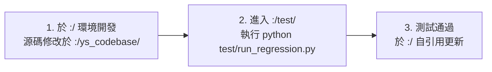

# YS-Codebase (`ys-codebase`)

一套專為個人獨立開發者、中小型團隊與 Case-by-Case / 接案專案打造的輕量、模組化 AI Agent 代碼庫工程工具與管理系統。

---

## 🌟 核心架構特色

1. **自引用（Dogfooding）三層架構**：
   - **`:/ys_codebase/` [完整原始碼開發環境]**：工具庫核心原始碼（Installer、CLI、`source/` 源碼庫、`build/` 發布產物空間與模組架構設計文檔）。
   - **`:/test/` [假專案測試環境]**：模擬下游真實消費者專案，配置獨立沙盒與自動化回歸測試套件（`run_regression.py`）。
   - **`:/` [自引用 Dogfooding 環境]**：根專案作為使用者，使用 `ys-codebase` 工具（包含 `modules/agents-workflow`、`docs/` 知識庫與 `plans/` 計畫紀錄）。
2. **統一 CLI 調度器 (`yscb_cli.py`)**：統一轉接各模組專屬 CLI（如 `python yscb_cli.py agents-workflow verify`）與 Installer 管理指令。
3. **極簡單檔起手**：下游專案僅需 checkout [`yscb_installer.py`](./yscb_installer.py) 與同層 [`yscb_config.json`](./yscb_config.json) 即可運作。
4. **Zero External Dependency**：純 Python 3 標準庫實現，跨平台（Windows / macOS / Linux）免安裝額外套件。
5. **Source / Build / Modules 三層空間分流**：
   - **標準使用者模式 (Build ➔ Modules)**：從遠端 `build/<module>`（最低執行需求發布物）拉取並安裝至本地 `modules/<module>` 運行。
   - **開發者源碼模式 (Source Mode, `--source`)**：安裝 `source/<module>` 完整原始碼至本地 `source/<module>`，並**自動強制相依安裝 `source/core` 基礎庫**，解鎖本地 Modify、Build 與 Push 能力。

---

## 📁 倉庫結構

```text
ys-codebase/ (專案根目錄，代表 ":/"，自引用 Dogfooding 環境)
├── yscb_cli.py                        # [自引用] 統一 CLI 調度轉接器
├── yscb_installer.py                  # [自引用] 核心安裝管理引擎
├── yscb_config.json                   # [自引用] 專案核心設定檔 (已安裝 modules/agents-workflow)
├── yscb_config.template.json          # 純淨設定檔範本
├── README.md                          # 專案說明
├── docs/                              # 專案頂層說明與架構索引知識庫
├── plans/                             # 專案 Plans 與需求規劃紀錄
│
├── modules/                           # [自引用運行空間] 根專案自引用安裝的發布物模組
│   └── agents-workflow/               # AI Agent SOP 工作流模組 (運行實例)
│
├── ys_codebase/                       # [完整原始碼開發環境 (":/ys_codebase/")]
│   ├── yscb_cli.py                    # 工具庫核心 CLI 調度器
│   ├── yscb_installer.py              # 工具庫核心安裝管理引擎
│   ├── yscb_config.template.json      # 模組設定模板
│   ├── source/                        # [源碼空間] 模組完整源碼 (開發者模式目標)
│   │   ├── core/                      # 核心基座 (任何 --source 模組的強制相依底層)
│   │   └── agents-workflow/           # AI Agent SOP 工作流模組源碼
│   ├── build/                         # [發布產物空間] 最低執行需求產物
│   │   └── agents-workflow/           # 由 source/ 打包產出，供下游純使用端拉取
│   └── docs/                          # 工具庫專屬架構、規範與設計文檔
│
└── test/                              # [假專案測試環境 (":/test/")]
    ├── yscb_cli.py                    # 測試沙盒 CLI
    ├── yscb_installer.py              # 測試沙盒安裝引擎
    ├── yscb_config.json               # 測試沙盒配置檔
    ├── run_regression.py              # 一鍵全自動回歸測試腳本
    └── tests/                         # 自動化單元與整合測試套件 (含 test_installer.py)
```

---

## 🔄 未來標準作業流程 (Standard Workflow)



1. **開發階段 (`:/` 環境，源碼位於 `:/ys_codebase/`)**：
   - 所有工具鏈、模組原始碼（`yscb_installer.py`、`source/core/`、`source/agents-workflow/` 等）僅在 `:/ys_codebase/` 內修改。
   - 外部（`:/`）僅保留專案 Plans、Docs、IDE 工作流設定等。
   - 於 `:/ys_codebase/` 執行 `build` 將 `source/` 打包成 `build/`。
2. **回歸測試階段 (`:/test/`)**：
   - 執行 `python test/run_regression.py` 進行單元、整合與下游沙盒端到端回歸測試。
3. **自引用更新階段 (`:/`)**：
   - 測試驗證全數通過後，在 `:/` 自引用環境執行更新，同步套用最新產出物。

---

## 🚀 快速上手 (Quick Start)

### 1. 檢視可用模組與指令
```bash
python yscb_cli.py --help
```

### 2. 執行自動化回歸測試
```bash
python test/run_regression.py
```

### 3. 使用 Installer 管理模組
```bash
# 初始化設定檔
python yscb_cli.py installer init

# 安裝模組 (發布物模式)
python yscb_cli.py installer install agents-workflow

# 檢視模組安裝狀態
python yscb_cli.py installer status
```

### 4. 調用已安裝模組專屬 CLI
```bash
# 查看 agents-workflow 指令手冊
python yscb_cli.py agents-workflow --help

# 執行 Dev Plan 合規稽核
python yscb_cli.py agents-workflow verify

# 掃描計畫狀態矩陣
python yscb_cli.py agents-workflow scan --all
```

---

## 📄 License
MIT License
