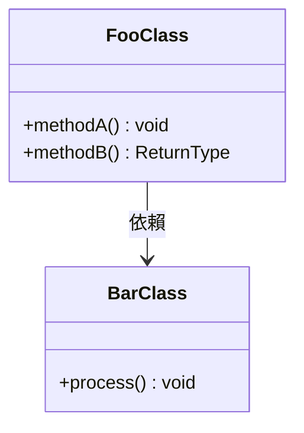

# Baz

> 一句話描述：[這個模塊的核心職責是什麼。]

## 職責邊界

**做什麼**：
- [此模塊負責的核心功能 1]
- [此模塊負責的核心功能 2]

**不做什麼**（邊界）：
- [明確列出此模塊不處理的事項，防止誤用]

---

## 架構概覽

[30 秒內讓讀者理解整體結構。可使用 Mermaid 圖表。若結構簡單可省略圖表。]

---

## 文件導覽

> 若目前只有 README 單一文件，刪除本節並直接在下方展開內容。

| 文件 | 說明 |
| :--- | :--- |
| [foo-algorithm.md](./foo-algorithm.md) | [Foo 演算法的核心原理說明] |
| [bar-system.md](./bar-system.md) | [Bar 系統的運作機制] |
| [DESIGN_NOTES.md](./DESIGN_NOTES.md) | 工程妥協記錄 |

---

## 關鍵知識點速查

> 僅列出 CAUTION 等級（可能致 Bug 或崩潰）的坑點。詳細知識點見各主題文件或 DESIGN_NOTES.md。

> [!CAUTION] 知識點：[最重要的坑點標題]
> [一句話說明：什麼情況下觸發，應如何避免。]

---

## 相關模塊

- [RelatedModuleA](../RelatedModuleA/README.md)：[與本模塊的關係]
- [RelatedModuleB](../../OtherNamespace/RelatedModuleB/README.md)：[與本模塊的關係]
