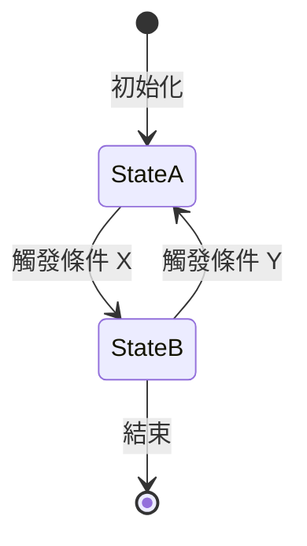

# [主題名稱]（例：Foo 演算法原理）

> 本文件說明 [具體主題]，適合需要了解 [使用場景] 的讀者。
> 不涵蓋：[明確說明本文件不討論的範圍]。

---

## 概述

[2–3 句說明這份文件的核心內容。]

---

## [主要內容章節一]

[深度說明。可使用 Mermaid 圖、程式碼片段。]

---

## [主要內容章節二]

[繼續說明。]

---

## 邊界條件與限制

- [已知限制 1：例如執行緒安全性]
- [已知限制 2：例如記憶體配置約束]

---

## 知識點

> [!CAUTION] 知識點：[坑點標題]
> [具體描述：什麼情況下觸發，正確的處理方式是什麼。]

> [!NOTE] 知識點：[設計細節標題]
> [解釋某個非顯而易見的行為或設計選擇。]

---

## 相關文件

- [README.md](./README.md) — 返回模塊首頁
- [DESIGN_NOTES.md](./DESIGN_NOTES.md) — 相關工程妥協說明
