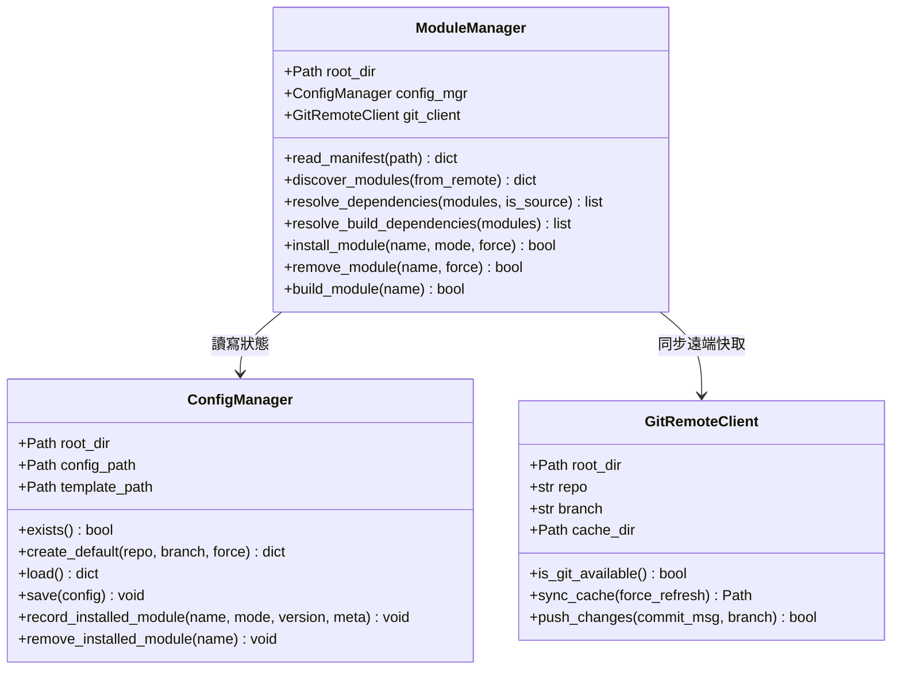

# Installer 核心引擎架構 (`yscb_installer.py`)

[`yscb_installer.py`](../../yscb_installer.py) 是 `ys-codebase` 體系的唯一執行與管理入口，負責全生命週期的設定、遠端同步、相依解析、模組安裝與建置發布。

---

## 🏛️ 內部核心架構與類別劃分

---

## 🔍 關鍵機制解析

### 1. 相依解析器 (Dependency Resolution)
- 透過 DFS 拓撲排序，遞迴解析各模組之 `dependencies`。
- **`--source` 源碼模式**：無條件自動將 `core` 置於安裝序列第一位。
- **`build` 建置模式**：自動遞迴解析待建置相依模組，但自動過濾排除 `core`。

### 2. 檔案同步與安裝隔離
- 使用 `shutil.copytree` 搭配 `dirs_exist_ok=True`，支援乾淨覆寫與增量補全。
- 使用者安裝模式只拉取 `build/<module>/`，杜絕開發期垃圾檔案污染專案。
