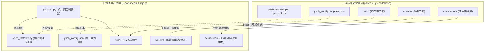
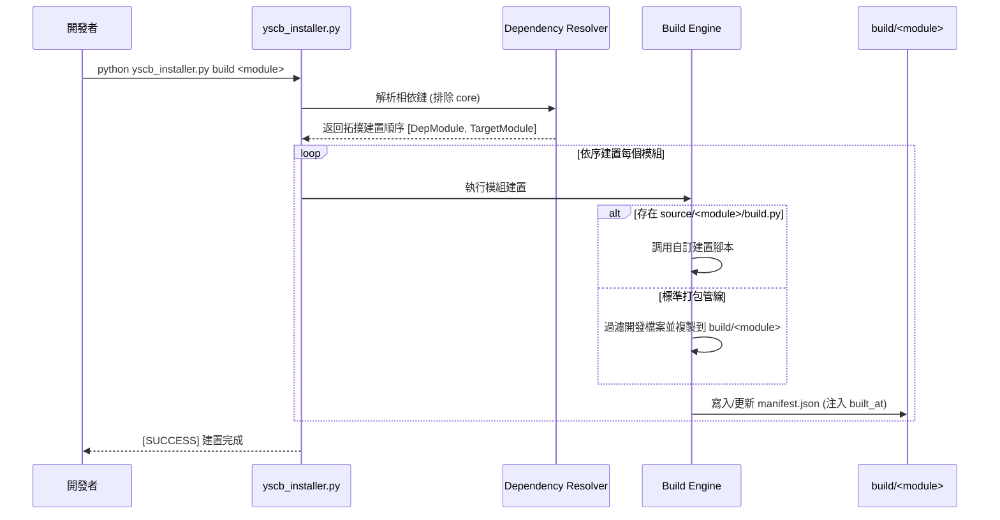

# 全域系統架構設計 (System Architecture)

`ys-codebase` 是一套為個人獨立開發者、中小型團隊與接案專案量身打造的模組化 AI Agent 工程工具庫。

---

## 🏛️ 核心設計原則

1. **統一轉接與極簡起手 (Unified Router & Entry Point)**：
   - 下游專案可透過 [`yscb_cli.py`](../../yscb_cli.py) 統一調度所有模組指令與安裝器。
   - 專案核心依託 [`yscb_installer.py`](../../yscb_installer.py) 與同層設定檔 [`yscb_config.json`](../../yscb_config.json) 驅動模組拉取、更新與管理。
2. **Zero External Dependency (零第三方依賴)**：
   - 核心工具庫完全基於 Python 3.8+ 標準庫（`argparse`, `json`, `subprocess`, `shutil`, `pathlib`），跨全平台（Windows, macOS, Linux）即開即用。
3. **Source / Build 雙軌分流 (Dual-Track Lifecycle)**：
   - 使用者模式 (`install <module>`) 僅消費 `build/<module>/` 終端發布產物。
   - 開發者模式 (`install <module> --source`) 安裝 `source/<module>/` 原始碼，並自動連帶安裝 `source/core/` 基座。
4. **標準化 Scripts 與生命週期 Hook**：
   - 模組透過 `module/scripts/cli.py` 對外暴露子指令，透過 `_installed.py` 與 `_uninstall.py` 與安裝引擎進行生命週期連動。

---

## 🗺️ 系統拓撲與資料流 (System Topology)

---

## 📦 模組空間分層與相依規則

### 1. 源碼空間 (`source/`)
- **`source/core/`**：
  > [!IMPORTANT]
  > `core` 為基礎基座，僅存在於源碼空間，**不產出任何 `build/` 物件**。任何以 `--source` 安裝的模組，皆自動且強制相依於 `core`。
- **`source/<module>/`**：包含模組的完整開發源代碼、開發期配置、`config.template.json` 與可選的 `build.py` 自訂建置腳本。

### 2. 發布產出物空間 (`build/`)
- **`build/<module>/`**：
  - 透過 `python yscb_installer.py build <module>` 自動打包產出。
  - 自動排除開發垃圾檔案（`__pycache__`, `*.pyc`, `tests/`, `scratch/`, `.vscode/` 等）。
  - 在 `manifest.json` 中注入 `built_at` 時間戳，保證發布物具備版本一致性與可追溯性。

---

## 🔄 模組構建管線 (Build Pipeline)

