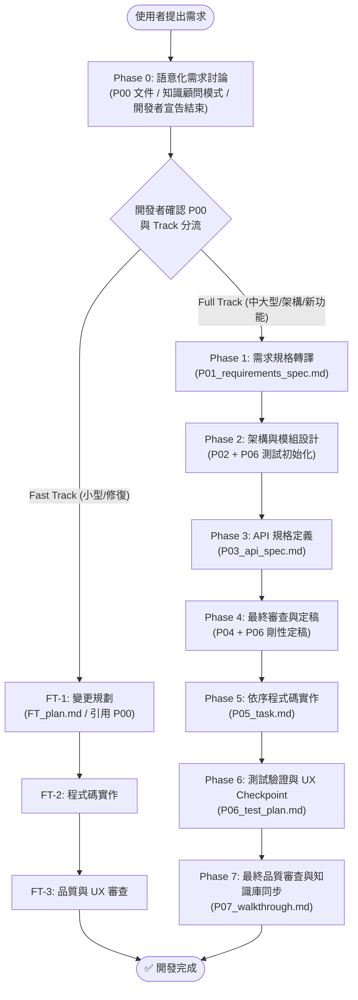

# 標準開發作業流程 (Development SOP)

本文件定義 AI Agent 在本專案中進行功能開發、架構重構或問題修復時**必須強制遵守**的標準作業流程 (SOP)。

---

## 核心原則

所有開發活動必須始終遵守以下三大原則：
1. **零臆測 (Zero Speculation)**：任何不確定的需求、API 行為或架構細節，必須主動向開發者釐清，嚴禁自行假設。
2. **可追溯 (Traceability)**：從需求 (FR/EC) 到架構、API、程式碼、測試計畫與 Commit 訊息，每個階段皆有對應文件留痕。
3. **分級管控 (Graduated Control)**：依 Phase 0 分流評估任務規模，嚴格執行 Full Track 或 Fast Track。

---

## 🚨 Agent 執行紀律（防呆鐵律）

- **嚴禁連發**：單次 Turn 最多執行一個 Phase。產出階段文件後，必須詢問開發者並**立即 End Turn** 等待回覆。
- **Checkpoint 強制等待**：產出 Phase 文件後，必須等待開發者明確給予「確認/同意/推進」指示，嚴禁 Agent 自行假設通過並跨入下一個 Phase。
- **「問答 $\neq$ 推進」防呆條款 (Clarification $\neq$ Advancement Disambiguation)**：
  - **回覆意圖二分法**：Agent 必須嚴格區分開發者的回覆類型：
    - **類型 A：局部解答 / 意見回饋**（例：解答 Agent 提問、提供特定參數、修改某欄位）➔ Agent **僅可更新當前 Phase 文件**，呈遞更新摘要與變更處，並明確詢問「已為您更新 [項目]，請問本階段內容是否確認無誤，可指示推進至 Phase X？」並**立即 End Turn 等待**，**絕對禁止直接跨入下一 Phase**！
    - **類型 B：推進 / 定稿指令**（例：「確認」、「通過」、「進入 Phase X」、「沒有其他問題了」）➔ 只有接收到此類明確信號，Agent 才能將當前 Phase 標記為 `Confirmed` / `Passed` 並推進。
  - **嚴禁複合推論**：絕對禁止 Agent 自行假設「因為開發者解答了疑問 ➔ 代表整份文件無其他問題 ➔ 自動推進」。
  - **更新後二次確認 (Update & Re-confirm Loop)**：文件修訂後必須重新呈遞修改摘要，並重新等待開發者明確給出類型 B 指令。
- **嚴禁空降實作**：未經 Phase 1~4（或 FT-1）規劃並獲得開發者確認前，**絕對禁止直接編寫或修改原始碼**。
- **Phase 0 討論模式鐵律**：
  - **Agent 嚴禁臆測需求**：在 Phase 0 討論階段，Agent 僅作為知識顧問，針對開發者的陳述提出釐清問題。除非開發者明確要求，否則嚴禁主動提出設計方案、功能清單或架構建議。
  - **討論結束必須由開發者明確宣告**：Agent 絕對禁止自行判定需求已釐清完整並推進。必須等待開發者明確表示（如「討論完成」、「進入下一步」）後，才可將 `P00_semantic_requirements.md` 標記為 `Confirmed`。
  - **Track 分流在 P00 Confirmed 後才執行**：P00 確認後，在同一輪呈遞分流建議，由開發者最終決定 Track。
- **Phase 1 規格轉譯嚴禁新增臆測**：`P01_requirements_spec.md` 中的每一個 FR 必須可回溯至 `P00_semantic_requirements.md` 中的具體使用情境或 API 使用案例。嚴禁 Phase 1 在 P00 範疇之外新增未經討論的功能點。
- **Test-First 測試前置定稿條款**：`P06_test_plan.md` 必須於 Phase 2~3 隨設計同步初始化草擬 (Draft)，並於 Phase 4 Review 階段與 `P04_implementation_plan.md` 一併剛性定稿 (Confirmed)，嚴禁延至 Phase 6 才開始憑空設計測試項目。Phase 6 之主軸純粹為「測試執行 + 缺陷修復 + 互動/UX/硬體驗證」。
- **Phase 6 人工/UX/硬體測試 Checkpoint 強制等待關卡**：即使自動化測試 100% Passed，Agent **絕對禁止**自行將 P06 標記為 `Passed` 或擅自進入 Phase 7！必須呈遞測試結果，並明確詢問開發者進行實際互動/視覺/硬體驗證。必須等待開發者明確回覆「驗證通過/指示免測」後，方可將 P06 標記為 Passed 並推進至 Phase 7。
- **Phase 6 驗證防呆鐵律 (無 Log 即未驗證)**：若 CLI 編譯/測試命令執行受阻（例如環境權限或 log 無法截取），Agent **絕對禁止**在 `P06_test_plan.md` 與對話中標記 `Passed`。必須明確標記 `[未實機編譯/僅靜態檢查]`，並呈遞精確命令請開發者於控制台執行回填。
- **全階段文件模板剛性對齊**：所有 Phase (P00~P07 / FT_plan) 產出文件 **必須 100% 嚴格鏡像標準模板結構**（包含指定欄位、表格與 Header 標頭），嚴禁 Agent 自行簡化或遺漏模板區塊。
- **目錄歸檔紀律與腳本優先**：
  - 定式作業（歸檔、檢索、掃描）優先呼叫 `.agents/scripts/` 下的 Python 工具腳本。
  - **嚴禁 Agent 主動歸檔**：所有計畫預設留存於 `.agents/dev_plans/` 原位，僅在開發者明確下達歸檔指令時才執行歸檔腳本。

---

## 工作流概覽

---

## 階段詳細規範

### Phase 0：語意化需求討論 (Semantic Requirements Discovery)

#### 目標
在動筆寫任何規格之前，以**開放式對話**完整釐清開發者的真實意圖與使用情境，建立可追溯的語意化需求文件 (`P00_semantic_requirements.md`)。Track 分流在 P00 確認後才執行。

#### 討論模式三大原則

1. **Agent = 知識顧問**：Agent 的職責是提出好問題、提供業界參考、揭示潛在邊界，**絕對不主動提出設計方案或功能列表**，除非開發者明確要求（如「幫我列出常見方案」）。
2. **開發者主導結束**：討論**必須由開發者明確宣告結束**，Agent 嚴禁自行判定需求完整並推進。
3. **P00 先於分流**：完整討論 → P00 Confirmed → Track 分流，三步驟嚴格有序。

#### 執行步驟

1. **建立工作目錄**：`.agents/dev_plans/{YYYY_MM_DD_HHMM_功能名稱}/`
2. **初始化 P00 草稿**：依 `.agents/workflows/templates/P00_semantic_requirements.md` 建立 `P00_semantic_requirements.md`（狀態標記為 `Discussing`），選擇對應計畫類型：
   - **Feature**：引導開發者描述使用情境 (User / Developer Scenarios) 與 API 使用者心智 (Developer Mental Model)。
   - **Refactor / Architecture**：引導開發者描述現況痛點與期望演進形態。
   - **Bug Fix**：記錄精確的復現步驟、預期行為與實際行為。
   - **Performance**：記錄效能問題症狀、量測基準與效能目標。
   - **Docs**：記錄文檔目標與涵蓋範疇。
   - **自訂類型**：依實際情境自訂類型名稱與記錄結構。
3. **開放式討論**：Agent 作為知識顧問，針對開發者陳述提問釐清，持續補充 `P00` 草稿的「開放議題紀錄」欄位。
4. **等待討論結束宣告**：開發者明確表示討論結束後，Agent 整理並最終化 `P00`，呈遞給開發者確認內容正確性。

→ **Checkpoint** → 開發者確認 P00 內容正確（狀態更新為 `Confirmed`）

5. **執行 Track 分流**：P00 Confirmed 後，Agent 依以下矩陣提出分流建議，由開發者最終決定：

| Track | 適用場景 |
| :--- | :--- |
| **Fast Track** | • 修改檔案數 $\le 2$ • 不變更 Public API / 介面簽名 • 不引入新的跨模組依賴 • 純 Bug 修復、內部微調或簡單擴充 |
| **Full Track** | • 新增功能或跨模組重大變更 • 修改 Public API / 介面簽名 • 涉及架構調整、底層重構或資料流變更 • 任何高複雜度或高風險任務 |

6. 依 Track 建立後續結構：
   - **Fast Track** → 建立 `FT_plan.md`，將 P00 內容以引用形式嵌入 FT-1 節。
   - **Full Track** → 建立 `changelog.md`，進入 Phase 1。

---

### Phase 1：需求規格定義（規格轉譯自 P00）

#### 目標
將 `P00_semantic_requirements.md` 的語意需求 1:1 轉譯為可驗收的功能需求 (FR)、非功能需求 (NFR) 與邊界條件 (EC)。**嚴禁在 P00 範疇之外新增未經討論的功能點。**

#### 執行步驟
1. 依 `.agents/workflows/templates/P01_requirements_spec.md` 建立 `P01_requirements_spec.md`（狀態標記為 `Draft`），並於標頭標注「依據 P00」連結。
2. **規格轉譯（P00 → FR/EC）**：FR 表格中的每一行必須對應至 P00 的具體使用情境或 API 使用案例，填入「對應 P00 語意」欄。
3. 列出邊界/異常情況 (EC) 與非功能需求 (NFR)。
4. **查閱踩坑紀錄**：主動查閱相關模組在 `docs/` 及 `DESIGN_NOTES.md` 中的 `[!CAUTION]` 或 `[!WARNING]`。
5. 於 `changelog.md` 記錄本階段決策。

→ **Checkpoint** → 開發者確認（狀態更新為 `Confirmed`） → 進入 Phase 2

---

### Phase 2：架構與模組設計

#### 目標
進行架構分層、模組劃分、依賴邊界與資料流設計。

#### 執行步驟
1. 依 `.agents/workflows/templates/P02_architecture_plan.md` 建立 `P02_architecture_plan.md`（標記為 `Draft`）。
2. 繪製 Mermaid 循序圖或資料流圖。
3. 盤點受影響的模組與檔案清單。
4. **Test-First 初始化**：依 `.agents/workflows/templates/P06_test_plan.md` 建立初始草稿 `P06_test_plan.md`（標記為 `Draft`），預先將 FR/EC 映射為測試項目。

→ **Checkpoint** → 開發者確認（狀態更新為 `Confirmed`） → 進入 Phase 3

---

### Phase 3：API 規格定義與依賴拓撲

#### 目標
定義所有 Public/Protected API 簽名、型態、錯誤處理與依賴拓撲順序。

#### 執行步驟
1. 依 `.agents/workflows/templates/P03_api_spec.md` 建立 `P03_api_spec.md`（標記為 `Draft`）。
2. 定義型態簽名、命名風格與物理/數學顯式單位。
3. 定義依賴拓撲（實作順序）。
4. **執行 Extension 擴充**：若專案定義了 `P03_*_ext.md`，於標準步驟完成後執行擴充檢查。

→ **Checkpoint** → 開發者確認（狀態更新為 `Confirmed`） → 進入 Phase 4

---

### Phase 4：最終審查與定稿 (Review & Test-First Confirmed)

#### 目標
全面交叉審查 Phase 1~3 產出物，並將實作計畫與測試計畫一併剛性定稿。

#### 執行步驟
1. **交叉驗證 Checklist**：
   - [ ] 需求規格書中的每個 FR，在 API 規格書中有對應介面
   - [ ] 需求規格書中的每個 EC，在 API 規格書中有對應錯誤策略
   - [ ] 風險評估有對應緩解措施
   - [ ] 物理/數學變數皆帶有顯式單位後綴
2. **靈魂拷問 (Stress Test)**：Agent 主動扮演架構審查員，提出至少 1 個尖銳且具建設性的問題，開發者回答後方可繼續。
3. **產出最終計畫書**：依 `P04_implementation_plan.md` 模板彙整 DR 與實作細節，狀態更新為 `Confirmed`。
4. **Test-First 定稿**：同步審查並定稿 `P06_test_plan.md`，狀態更新為 `Confirmed`。

→ **Checkpoint** → 開發者確認「開始實作」 → 進入 Phase 5

---

### Phase 5：程式碼實作

#### 目標
嚴格按照 `P04_implementation_plan.md` 依序撰寫程式碼。

#### 執行步驟
1. **進度追蹤**：於工作目錄建立 `P05_task.md`，列出 TODO 清單 `[ ]`。
2. **依序實作**：按依賴拓撲實作，每完成一項於 `P05_task.md` 標記 `[x]`。
3. **編譯驗證**：每個主要模組實作完成後執行編譯檢查。
4. **偏差處置**：
   - **Critical**（影響 Public API / 架構）：**立即停止實作**，觸發討論並回退修正計畫。
   - **Major**（不影響 Public API 但影響內部邏輯）：暫停當前項目並向開發者回報。
   - **Minor**（不影響架構之細微調整）：自行處理並記錄於 `P05_task.md`。

→ 所有 TODO 項目完成 → 進入 Phase 6

---

### Phase 6：測試與驗證

#### 目標
執行 Phase 4 定稿之 `P06_test_plan.md`，完成自動化驗證、人工/UX 驗證與缺陷修復。

#### 執行步驟
1. **自動化測試執行**：執行 CLI 編譯與單元測試，記錄輸出日誌。若命令受阻，標記 `[未實機編譯/僅靜態檢查]`。
2. **人工 / UX / 硬體驗證 Checkpoint（強制等待）**：
   - Agent **絕對禁止**代勾或自行標記 `Passed`。
   - 呈遞測試結果，明確詢問開發者進行實際互動/視覺/實機驗證。
   - 獲得開發者明確回覆「驗證通過」後，方可將 P06 標記為 `Passed`。
3. **Bug 修復子循環**：
   - 計畫缺陷：回退 Phase 1~4 修正計畫後再修復。
   - 實作錯誤：修復後重新執行受影響測試。

→ 所有測試 Passed + 開發者驗證確認 → 進入 Phase 7

---

### Phase 7：最終品質 Review

#### 目標
全面審查程式碼品質、同步知識庫文檔與產出 Commit 訊息。

#### 執行步驟
1. **代碼清理與規範檢查**：移除 Debug 語句、檢查命名規範、日誌與記憶體安全。
2. **知識庫同步 (Knowledge Base Sync)**：
   - 依 `DocumentationStandards.md` 與專案鏡像規則更新 `docs/` 下對應模組之 `README.md`、`[topic].md` 或 `DESIGN_NOTES.md`。
   - 依 `global_changelog.md` 模板將本次變更摘要追加至專案根目錄 `CHANGELOG.md` 最上方。
3. **產出 Commit 訊息**：依 Conventional Commits 格式（`<type>(<scope>): <標題>`）產出。
4. **產出變更摘要**：依 `P07_walkthrough.md` 模板撰寫變更摘要。
5. **目錄保留原位**：工作目錄維持原位，僅在開發者明確指示時呼叫 `archive_plan.py` 歸檔。

→ 開發者確認審查通過 → ✅ 開發完成

---

## Fast Track 流程

適用於小型、低風險修改（$\le 2$ 檔案且無 Public API 變更）。

### FT-1：需求確認 & 變更規劃
1. 建立 `FT_plan.md`（標記為 `Planning`）。
2. 確認無 Public API 與跨模組依賴影響（通過架構確認 Checklist）。
3. → **Checkpoint** → 開發者確認 → FT-2

### FT-2：實作
1. `FT_plan.md` 狀態更新為 `Implementing`。
2. 逐項實作並追蹤進度，每步執行編譯驗證。若遇 Critical 偏差立即升級為 Full Track。
3. → 實作完成 → FT-3

### FT-3：品質 Review
1. `FT_plan.md` 狀態更新為 `Reviewing`。
2. 通過代碼清理、命名、文檔同步與驗證 Checklist。
3. 填入 Commit 訊息與變更摘要，狀態更新為 `Completed`。
4. → **Checkpoint** → 開發者確認 → ✅ 開發完成
