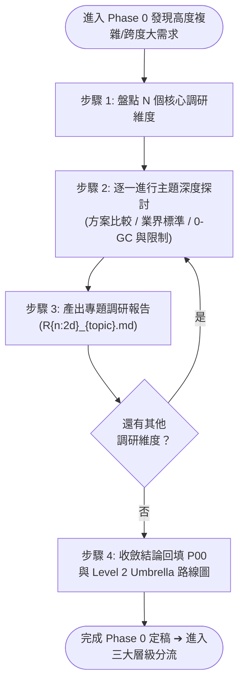

# 深度技術調研工作流 (Development SOP — Research)

本 Workflow 是 **Phase 0 語意需求討論的升級版**。當需求涉及全新技術領域、大型架構重構、高不確定性或跨多模組的大規模資產演進時，Agent 與開發者啟動本流程，針對多個核心維度進行深入探討、方案權衡與論證，並產出專業自包含的專題調研報告。

---

## 🎯 核心原則與心智模型

1. **Research = P00 的深度升級版**：
   - 本質依然屬於 Phase 0 的「討論與釐清」，但處理的是高複雜度、跨度大的架構決策。
   - 討論並非單純一問一答，而是針對具體技術維度進行橫向探索、方案比較 (Pros & Cons) 與邊界確認。
2. **免除死板模板束縛 (Freedom from Rigid Templates)**：
   - 各調研專題具有高度特殊性，**不使用固定模板**。
   - 依該主題需求自由組織最合適的論述架構（文字論證、Mermaid 循序/拓撲圖、方案對比矩陣、數據結構與介面偽代碼範例）。
3. **標準前綴命名規範 (Standard File Naming)**：
   - 調研報告統一存放於計畫目錄下，採用標準前綴：**`R{n:2d}_{topic}.md`**
   - *範例*：
     - `R01_architecture_classification_reference.md`
     - `R02_existing_assets_migration_strategy.md`
     - `R03_companion_inspector_ux_design.md`

---

## 🚀 執行步驟

### 步驟 1：盤點核心調研維度 (Dimension Identification)
- 與開發者共同梳理出本次大型任務需要深度攻堅的 $N$ 個技術維度。
- *常見維度範例*：
  - **體系與分類設計**（如測試 4-Pillar 分類、事件分發管線、樣式層疊架構）
  - **資產遷移與命名相容性**（如現有 200+ 測試/組件遷移策略、命名空間對齊）
  - **工具鏈與互動架構**（如雙視窗 Companion 工具箱、Inspector 調試按鈕掛載）
  - **底層平台與圖形適配**（如 Win32 IMM 攔截、Skia 離屏渲染、GPU 批次合批）

---

### 步驟 2：主題深度探討與方案權衡 (In-Depth Technical Exploration)
- 一次聚焦一個技術維度展開開放式探討。
- **Agent 架構顧問職責**：
  - 主動橫向比對業界成熟實踐（如 Unity UITK、Chromium、Avalonia、React、WPF 等）。
  - 分析不同方案的優缺點 (Pros & Cons)、記憶體配置代價（如 0-GC 剛性約束）、線程安全性與相容性風險。
  - 協助繪製 Mermaid 架構圖或資料流圖以具象化設計思路。

---

### 步驟 3：產出專題調研報告 (`R{n:2d}_{topic}.md`)
- 該維度討論達成共識後，由 Agent 產出結構清晰、深度論證的獨立報告。
- **檔案命名**：`R01_{主題簡稱}.md`、`R02_{主題簡稱}.md` ...
- **報告建議涵蓋要點（自由組織，無固定限制）**：
  - 背景痛點與調研目標
  - 核心架構全景、分類矩陣與資料流 (Mermaid)
  - 方案對比矩陣與選擇理由
  - 邊界條件、極限情境與防護策略
  - 推薦落地方案與具體介面/數據結構規範

---

### 步驟 4：收斂與總綱彙整 (Synthesis into P00 & Roadmap)
- 當所有專題調研報告產出完畢後：
  1. 將調研形成的**核心公理、不可破壞之約束與架構決策**收斂回填至 `P00_semantic_requirements.md`。
  2. 若任務屬於大型多模組任務，產出子計畫拆分與依賴路線圖（`umbrella_overview.md` 或 `master_plan_subplans_roadmap.md`），明確各子計畫（`sub_01`, `sub_02`...）的邊界與驗收標準。
  3. 由開發者確認 P00 與 Roadmap，完成 Phase 0 定稿並進入 **Level 2 (Umbrella Plan)** 分流執行。
