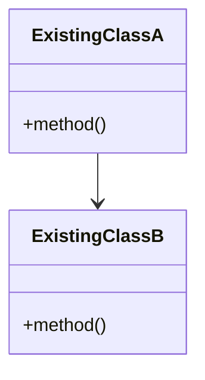
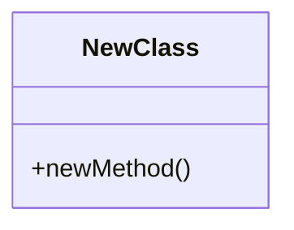

# 架構 & 變更計畫書 (Architecture & Change Plan)

> 功能名稱：[填入功能名稱]
> 建立日期：[YYYY-MM-DD]
> 狀態：Draft / Confirmed
> 模板版本：v1.0

---

## 現有架構摘要

[描述與本次改動相關的現有架構。可使用 Mermaid 圖表呈現類別關係與資料流。]



### 已閱讀的文檔

| 文檔路徑 | 關鍵資訊摘要 |
|---------|-------------|
| [docs/[Module]/README.md] | [從中獲得的關鍵架構資訊] |

---

## 目標架構

[描述修改後的目標架構。使用 Mermaid 圖表呈現新的類別關係與資料流。]



---

## 資料流

[描述關鍵的資料流路徑，從觸發到結果。]

```
[觸發源] → [處理步驟 1] → [處理步驟 2] → [輸出]
```

---

## 重複功能排查結果

| 搜索範圍 | 搜索目標 | 結論 |
|---------|---------|------|
| [例：Core/ 目錄] | [例：是否有類似的路徑搜尋功能] | [無重複 / 發現可複用: 路徑] |

---

## 風險評估

| ID | 風險類型 | 風險描述 | 等級 | 緩解策略 |
|----|---------|---------|------|---------|
| R-01 | 相容性 | [描述] | 高/中/低 | [策略] |
| R-02 | 效能 | | | |
| R-03 | 技術 | | | |
| R-04 | 依賴 | | | |

---

## 變更清單 (按依賴順序)

### Add (新增)

| 順序 | 影響等級 | 類別名稱 | 檔案路徑 | 職責概述 | 依賴項 |
|------|---------|---------|---------|---------|--------|
| 1 | HIGH | [ClassName] | [[path/to/file]] | [職責] | [依賴的既有類別] |

### Modify (修改)

| 順序 | 影響等級 | 類別名稱 | 檔案路徑 | 修改範圍概述 | 影響的下游 |
|------|---------|---------|---------|-------------|-----------|
| 1 | MED | [ClassName] | [[path/to/file]] | [修改內容] | [受影響的類別/模組] |

### Remove (移除)

| 順序 | 影響等級 | 類別名稱 | 檔案路徑 | 移除理由 | 遷移方案 |
|------|---------|---------|---------|---------|---------|
| 1 | LOW | [ClassName] | [[path/to/file]] | [理由] | [如何遷移既有使用者] |

---

## 回滾策略

- **回滾方式**：[例：Git revert / Feature flag / Compatibility shim]
- **回滾影響**：[回滾後是否有副作用]
- **預留措施**：[是否需要提前預留 feature flag 等]

---

## Decision Records

> 僅在本階段觸發 Deep Discussion 時填寫。

### DR-01: [議題標題]
- **議題**：[問題描述]
- **結論**：[最終決定]
- **理由**：[為什麼選擇這個方案]
- **排除方案**：[被排除的方案及原因]
