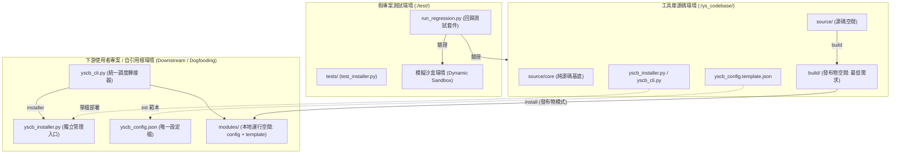
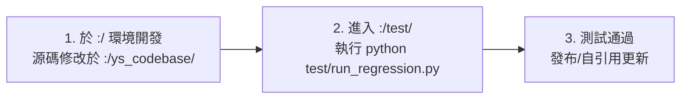

# 全域系統架構設計 (System Architecture)

`ys-codebase` 是一套為個人獨立開發者、中小型團隊與接案專案量身打造的模組化 AI Agent 工程工具庫。

---

## 🏛️ 核心設計原則

1. **三層環境架構體系 (Three-Tier Environment Architecture)**：
   - **`:/ys_codebase/` [完整源碼開發環境]**：包含 Installer 核心引擎、CLI 統一轉接器、`source/` 源碼空間、`build/` 發布產物空間與技術手冊。
   - **`:/test/` [假專案測試環境]**：作為下游消費端的隔離沙盒，配置獨立環境與全自動回歸測試腳本（`run_regression.py`）。
   - **`:/` [自引用 Dogfooding 環境]**：根專案作為使用者，在工具開發成熟後自引用使用 `ys-codebase` 工具（包含 `modules/`、`docs/` 知識庫與 `plans/` 計畫紀錄）。
2. **統一轉接與極簡起手 (Unified Router & Entry Point)**：
   - 下游專案可透過 `yscb_cli.py` 統一調度所有模組指令與安裝器。
   - 專案核心依託 `yscb_installer.py` 與同層設定檔 `yscb_config.json` 驅動模組拉取、更新與管理。
3. **Zero External Dependency (零第三方依賴)**：
   - 核心工具庫完全基於 Python 3.8+ 標準庫（`argparse`, `json`, `subprocess`, `shutil`, `pathlib`），跨全平台（Windows, macOS, Linux）免安裝任何外部依賴。
4. **Source / Build / Modules 三層空間分流 (Three-Tier Module Topology)**：
   - 使用者模式 (`install <module>`) 從遠端/本地 `build/<module>/` 拉取最低執行需求產物並安裝至本地 `modules/<module>/` 運行。
   - 開發者模式 (`install <module> --source`) 安裝 `source/<module>/` 原始碼至本地 `source/`，並自動連帶安裝 `source/core/` 基座。
5. **標準化 Scripts 與生命週期 Hook**：
   - 模組透過 `module/scripts/cli.py` 對外暴露子指令，透過 `_installed.py`、`_uninstall.py` 與 `_migration.py` 與安裝引擎進行生命週期連動。

---

## 🗺️ 系統拓撲與資料流 (System Topology)

---

## 📦 模組空間分層與相依規則

### 1. 源碼空間 (`source/`)
- **`source/core/`**：
  > [!IMPORTANT]
  > `core` 為基礎基座，僅存在於源碼空間，**不產出任何 `build/` 物件**。任何以 `--source` 安裝的模組，皆自動且強制相依於 `core`。
- **`source/<module>/`**：包含模組的完整開發源代碼、開發期配置、`config.template.json` 與可選的 `build.py` 自訂建置腳本。

### 2. 發布產出物空間 (`build/`)
- **`build/<module>/`**：
  - 透過 `python ys_codebase/yscb_cli.py installer build <module>` 自動打包產出。
  - 僅包含最低執行需求內容（排除 `config.json`、`__pycache__`, `*.pyc`, `tests/`, `scratch/`, `.vscode/` 等）。
  - 在 `manifest.json` 中注入 `built_at` 時間戳，保證發布物具備版本一致性與可追溯性。

### 3. 本地運行模組空間 (`modules/`)
- **`modules/<module>/`**：
  - 由純使用端透過 `installer install <module>` 從 `build/<module>/` 複製安裝而來。
  - 為本機實際運行空間，包含本地生成的 `config.json` 與 `config.template.json`。

---

## 🔄 標準作業流程 (Development & Release Workflow)

